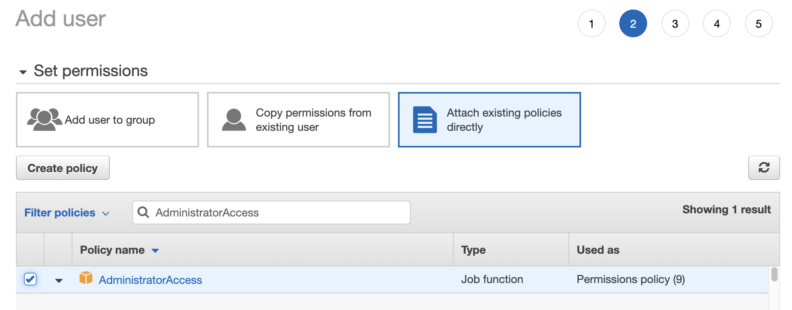
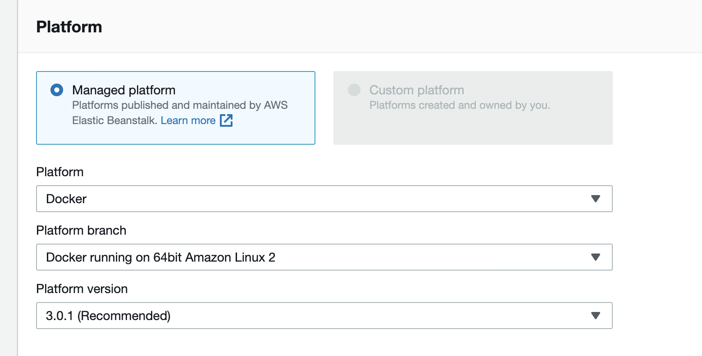
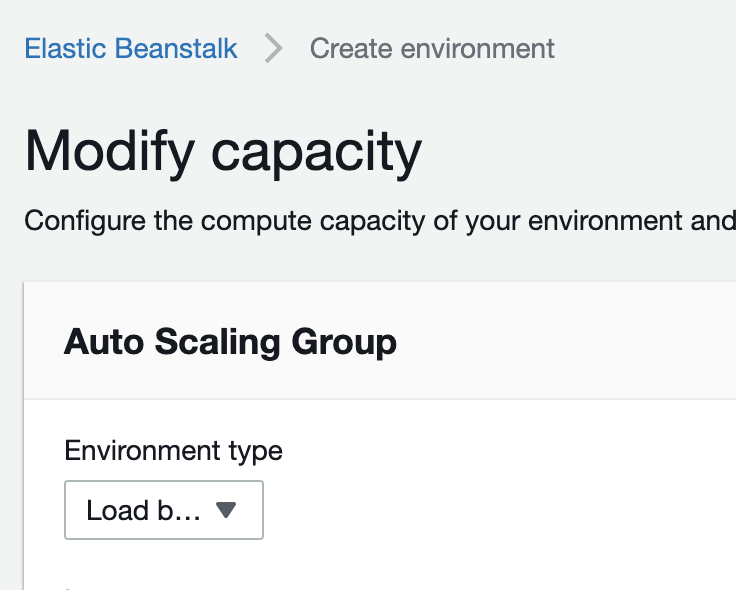
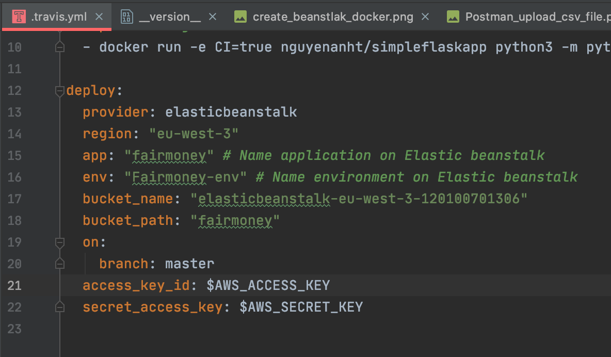
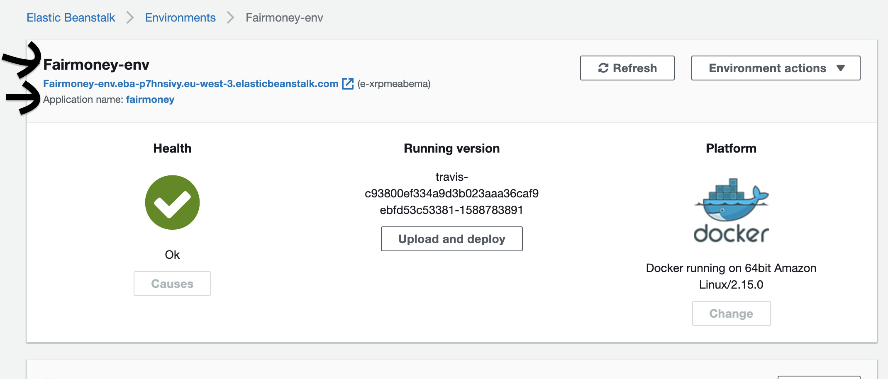
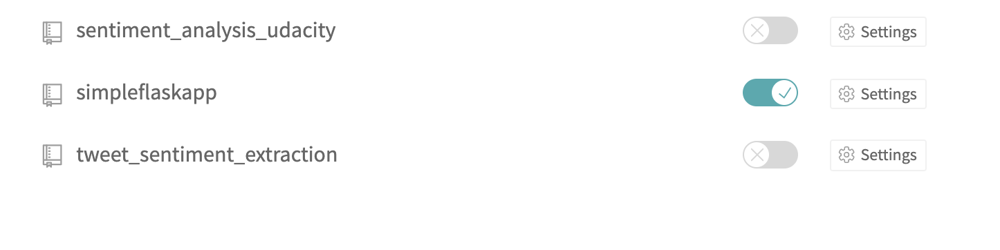
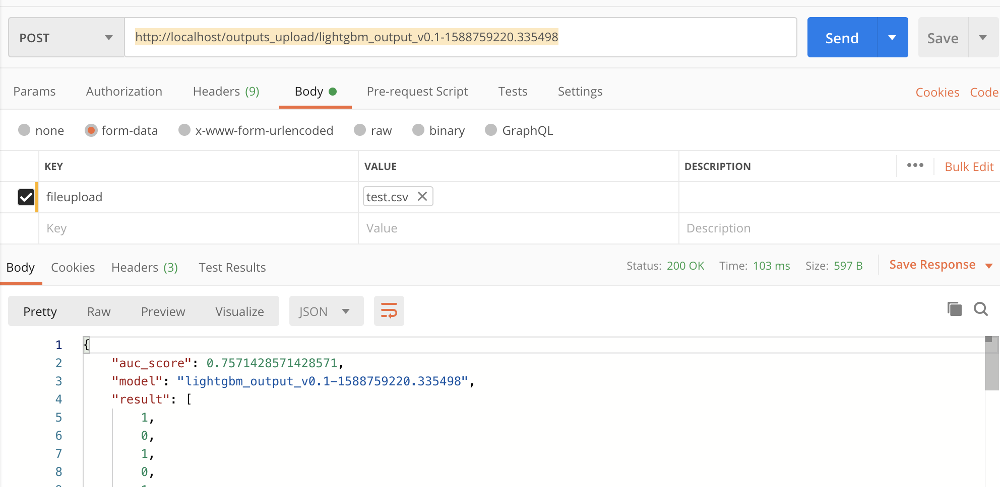

# Technical_test

The goal of this project is to write scripts to train simple models to predict the default behavior of customers, and build a minimalist webserver to serve the trained models.
We will use :
* LightGbm and Bayesian Optimization for the Machine Learning model
* Script in 
* Serve the model with Flask
* Docker for the ease to scale, and reproduce the same environment
* Travis-ci for the continuous integration and continuous delivery.
* AWS Elastic Beanstalk as the provider for the deployment


## Getting Started

These instructions will get you a copy of the project up and running on your local machine for development and testing purposes. See deployment for notes on how to deploy the project on a live system.

### Prerequisites

What things you need to install the software and how to install them

[Install Docker on your Machine](https://docs.docker.com/get-docker/) 

Please remove the .ebextensions folder if you are not planing to link domain name to you API.
This folder contains nginx conf to redirect http to https


### Installing

A step by step series of examples that tell you how to get a development env running

#### 1. Install the python Flask without Docker ####
If you want to test the API without deployment and without Docker, else skip this step and go directly to step 3.

* create a virtual env : ```python3 -m venv test_venv```

* Activate the virtual env on windows : ```test_venv\Scripts\activate.bat```

* Activate the virtual env on linux or macos : ```source test_venv/bin/activate```

* Install dependencies : ```pip install -r requirements.txt```
* Run the API : ```python application.py```

* Test the API with the endpoint : ```http://localhost:5000/models```

#### 2. Retrain a model ####
run : 
* ```cd src```
* ```python train_pipeline.py```

#### 3. Install with Docker ####

* Build docker image : ```docker build -t nguyenanht/fairmoney:latest .``` (Don't forget the point at the end)

* Run the container : ```docker run -it -p 80:8080 nguyenanht/fairmoney:latest```

* You can test the endpoint with ```http://localhost/models```


#### 4. For the deployment to AWS Elastic Beanstalk ####
* Create IAM USER with admin right to simplify the process
    
    Save the csv file because you will need the AWS_ACCESS_KEY and AWS_SECRET_KEY
* Create a new environment in Elastic Beanstalk
    * Choose web server application and click on select
    * Choose an application name (it is important to link the application name later in the _travis.yml file)
    * Choose Platform as below :
     
    * Click on configure more option and then capacity. Select environment type as Load balancer
      
    * Click on create environment

* Check in the .travis.yml file that deployment configuration is linked to the new Beanstalk application
     
     
     
* For the continuous integration and deployment with Travis-ci
    * Signup on [https://travis-ci.org ](https://travis-ci.org)  if the repository github is public else [https://travis-ci.com/](https://travis-ci.com/)
    * Activate your project in https://travis-ci.org/account/repositories to allow CI/CD
      
    * Click on Settings and add AWS_ACCESS_KEY and AWS_SECRET_KEY that you can find in the csv file saved when you created IAM Users

* Push some code to branch master and the magic happens !
```
git add .
git commit -m "travis.ci"
git push
```
 
 
 
#### DEMO With docker in local: 
If you want to test the API in production replace http://localhost by https://ngjohn.site
* Get list id_model : method get in postman => ```http://localhost/models```
* Get output prediction of a specific model : method Post => ```localhost/output/id_model```:
   Example of json raw request    
  ```{
	"checking_balance": "< 0 DM",
	"months_loan_duration": 47,
	"credit_history": "repaid",
	"purpose": "car (new)",
	"amount": 10722,
	"savings_balance": "< 100 DM",
	"employment_length": "0 - 1 yrs",
	"installment_rate": 1,
	"personal_status": "female",
	"other_debtors": "none",
	"residence_history": 1,
	"property": "real estate",
	"age": 35,
	"installment_plan": "none",
	"housing": "own",
	"existing_credits": 1,
	"dependents": 1,
	"telephone": "yes",
	"foreign_worker": "yes",
	"job": "unskilled resident"
	}```

* Get output prediction of the default model based on last timestamp :method Post => ```http://localhost/predict```
    Example of json raw request
    ```{
        "checking_balance": "< 0 DM",
        "months_loan_duration": 47,
        "credit_history": "repaid",
        "purpose": "car (new)",
        "amount": 10722,
        "savings_balance": "< 100 DM",
        "employment_length": "0 - 1 yrs",
        "installment_rate": 1,
        "personal_status": "female",
        "other_debtors": "none",
        "residence_history": 1,
        "property": "real estate",
        "age": 35,
        "installment_plan": "none",
        "housing": "own",
        "existing_credits": 1,
        "dependents": 1,
        "telephone": "yes",
        "foreign_worker": "yes",
        "job": "unskilled resident"}```
  
  
* Batch output with a specific model and load by default test.csv for the batch output : Method post =>
```http://localhost/outputs/lightgbm_output_v0.1-1588759220.335498```
    without any json raw request
    
* Batch output with a specific model and load the csv file of your choice for the batch output : Method post => ```http://localhost/outputs_upload/lightgbm_output_v0.1-1588759220.335498```
    * Choose csv like below
    


## Built With

* [Docker](https://www.docker.com/) - The project is contenerized
* [Flask](https://flask.palletsprojects.com/en/1.1.x/) - The framework used for the API
* [Travis-ci](https://travis-ci.com/) - Used for the continuous intregration and delivery and testing
* [Elastic Beanstalk](https://aws.amazon.com/fr/elasticbeanstalk/) - Used for the management of applications


## Authors

* **Johnathan Nguyen** 

## License

This project is licensed under the MIT License - see the [LICENSE.md](LICENSE.md) file for details


    
